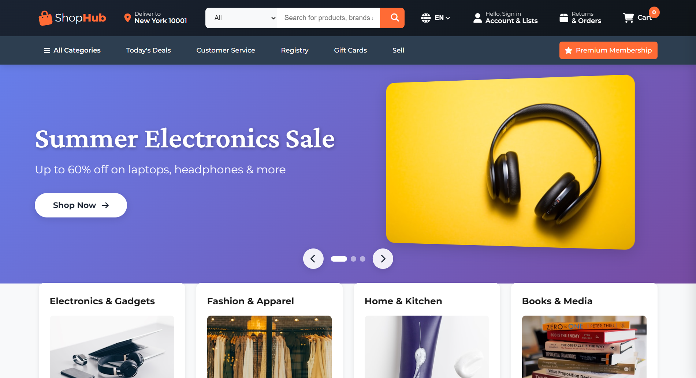

<div align="center">


# ShopHub — E-Commerce Marketplace Clone

### A feature-rich Amazon-inspired online shopping experience built with pure HTML, CSS & JavaScript

[](https://sumitbehera720.github.io/shophub/)
[](https://github.com/sumitbehera720/shophub/stargazers)
[](https://github.com/sumitbehera720/shophub/network)
[](LICENSE)

<br/>

> 🛒 *A pixel-perfect, fully interactive Amazon-inspired marketplace UI — complete with product browsing, cart management, and multi-category shopping, built with zero frameworks.*

<br/>



</div>

---

## 📌 Table of Contents

- [About the Project](#-about-the-project)
- [Live Demo](#-live-demo)
- [Features](#-features)
- [Tech Stack](#tech-stack)
- [Project Structure](#-project-structure)
- [Getting Started](#-getting-started)
- [Deployment](#-deployment)
- [Pages & Sections](#-pages--sections)
- [Roadmap](#roadmap)
- [Disclaimer](#disclaimer)
- [Author](#author)

---

## 🎯 About the Project

**ShopHub** is a fully functional frontend clone of Amazon, built to demonstrate proficiency in modern e-commerce UI patterns and core web technologies. From a dynamic hero carousel and category browsing to a fully working shopping cart — all crafted without a single framework or library.

This project was developed as part of a self-driven learning journey to explore real-world UI challenges such as cart state management with vanilla JavaScript, responsive product grids, multi-language support, and interactive component design.

---

## 🌐 Live Demo

🔗 **[https://sumitbehera720.github.io/shophub/](https://sumitbehera720.github.io/shophub/)**

> Best experienced on a desktop browser at full width.

---

## ✨ Features

<table>
  <tr>
    <td>🎠</td>
    <td><strong>Hero Carousel</strong></td>
    <td>Auto-sliding banner with Summer Electronics, Fashion & Home promotions</td>
  </tr>
  <tr>
    <td>🗂️</td>
    <td><strong>Category Navigation</strong></td>
    <td>Browse Electronics, Fashion, Home & Kitchen, Books, Sports, Toys & Games</td>
  </tr>
  <tr>
    <td>🔥</td>
    <td><strong>Today's Best Deals</strong></td>
    <td>Dedicated deals section with highlighted discounts and offers</td>
  </tr>
  <tr>
    <td>📦</td>
    <td><strong>Trending Products</strong></td>
    <td>Real-time filterable product grid by category — no page reload</td>
  </tr>
  <tr>
    <td>🛒</td>
    <td><strong>Shopping Cart</strong></td>
    <td>Slide-in cart drawer with live subtotal calculation and checkout CTA</td>
  </tr>
  <tr>
    <td>🪟</td>
    <td><strong>Product Modal</strong></td>
    <td>Detailed popup with description, key features & Add to Cart action</td>
  </tr>
  <tr>
    <td>🌍</td>
    <td><strong>Multi-Language Support</strong></td>
    <td>Language switcher supporting EN, ES and FR in the header</td>
  </tr>
  <tr>
    <td>📍</td>
    <td><strong>Delivery Location</strong></td>
    <td>Amazon-style delivery address display in the navbar</td>
  </tr>
  <tr>
    <td>🔍</td>
    <td><strong>Search Bar</strong></td>
    <td>Category-scoped search input in the navigation header</td>
  </tr>
  <tr>
    <td>📱</td>
    <td><strong>Responsive Design</strong></td>
    <td>Fully optimized layout across all screen sizes</td>
  </tr>
</table>

---

<a name="tech-stack"></a>
## 🛠️ Tech Stack

<div align="center">


</div>

| Layer | Technology | Purpose |
|-------|------------|---------|
| Structure | HTML5 | Semantic page layout and content |
| Styling | CSS3 | Animations, flexbox/grid, responsive design |
| Logic | Vanilla JavaScript | Cart state, filters, carousel, modals |
| Hosting | GitHub Pages | Free, fast static site deployment |

---

## 📁 Project Structure

```
shophub/
│
├── 📄 index.html          # Main HTML entry point
├── 🎨 style.css           # Global styles, animations & responsive rules
├── ⚙️  script.js           # All interactivity — cart, filters, carousel, modals
└── 📘 README.md           # Project documentation
```

---

## 🚀 Getting Started

### Prerequisites

No dependencies or build tools required. Just a modern web browser.

### 1. Clone the Repository

```bash
git clone https://github.com/sumitbehera720/shophub.git
cd shophub
```

### 2. Run Locally

**Option A — Open directly:**
```bash
# Simply open index.html in your browser
open index.html         # macOS
start index.html        # Windows
xdg-open index.html     # Linux
```

**Option B — Use a local server (recommended for best results):**
```bash
# Using Node.js
npx serve .

# Using Python
python -m http.server 8000
```

Then navigate to `http://localhost:8000` in your browser.

---

## 🌍 Deployment

This project is deployed on **GitHub Pages**. To deploy your own fork:

```bash
# Step 1: Fork this repository on GitHub

# Step 2: Go to your repo → Settings → Pages

# Step 3: Under "Source", select the main branch and / (root)

# Step 4: Save — your site will be live at:
# https://<your-username>.github.io/shophub/
```

---

## 🏪 Pages & Sections

| Section | Description |
|---------|-------------|
| 🎠 **Hero Carousel** | Auto-rotating banners — Summer Electronics, Fashion Forward, Home Essentials |
| 🗂️ **Shop by Category** | Visual category cards — Electronics, Fashion, Home & Kitchen, Books |
| 🔥 **Today's Best Deals** | Curated discount products with sale pricing |
| 📦 **Trending Products** | Filterable grid — All, Electronics, Fashion, Home, Books |
| 🛒 **Shopping Cart** | Slide-in drawer with item list, subtotal & checkout button |
| 🪟 **Product Modal** | Full product detail view with features & Add to Cart |
| 🔝 **Back to Top** | Smooth scroll-to-top button |
| 🦶 **Footer** | Amazon-style four-column footer with helpful links |

---

<a name="roadmap"></a>
## 🗺️ Roadmap

- [x] Hero banner carousel with multiple slides
- [x] Category-based product filtering
- [x] Shopping cart with live subtotal
- [x] Product detail modal
- [x] Multi-language switcher (EN / ES / FR)
- [x] Delivery location display in header
- [ ] Working search with live product filtering
- [ ] User authentication UI (Sign in / Register)
- [ ] Wishlist & Save for Later
- [ ] Product star ratings & reviews
- [ ] Checkout & order summary page
- [ ] Dark mode toggle

---

<a name="disclaimer"></a>
## ⚠️ Disclaimer

This project is built **purely for educational and portfolio purposes**. It is **not affiliated with, endorsed by, or connected to Amazon.com, Inc.** in any way. All product images are sourced from [Unsplash](https://unsplash.com). Brand names and trademarks belong to their respective owners and are used here solely for demonstrative purposes.

---

<a name="author"></a>
## 👨‍💻 Author

<div align="center">

**Sumit Behera**

*Frontend Developer | UI Enthusiast*

[](https://github.com/sumitbehera720)

<br/>

⭐ **If you found this project helpful or inspiring, please consider giving it a star!** ⭐

</div>

---

<div align="center">

© 2025 ShopHub Clone · Designed & Developed with ❤️ by **Sumit Behera**

</div>
